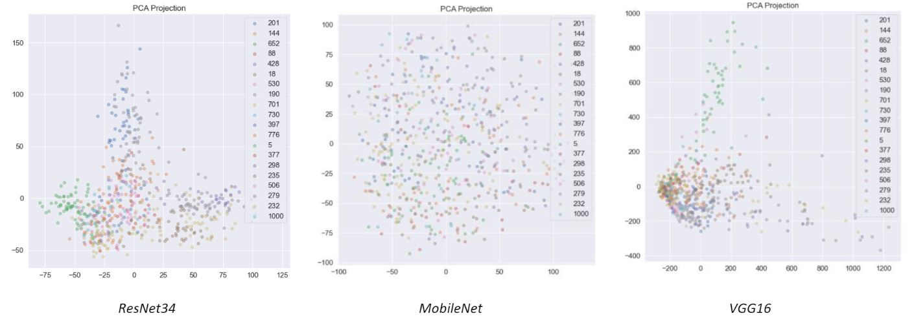

# Fine Grained Image Classification Neural Network

## Data
The iNaturalist2017 dataset can be downloaded from [INaturalist_link](https://github.com/visipedia/inat_comp#data). This dataset contains over 900 classes labels of plants and animals images.
Please unzip the "train_val2019" folder and put the following files in this folder:
 - `id2img.json `: Dictionary file, map image_id to image_name.
 - `img2id.json` : Dictionary file, map image_name to image_id.
 - `trainlist.txt/vallist.txt/testlist.txt`: text file, each row contains image_name, image_id, category_id
 
## Supervised Image Classification Model
2 versions for the classifier, one using pytorch the other using keras. Both version use a ResNet architecture, to test a transfer learning model with Imagenet weights and also test a model trained from scratch. We follow a similar metric to the classification tasks of the ILSVRC. 

[Resnet paper link](git-docs/resnet.pdf)

For each image, an algorithm will produce 5 labels. We allow 5 labels because some categories are disambiguated with additional data provided by the observer, such as latitude, longitude and date. It might also be the case that multiple categories occur in an image (e.g. a photo of a bee on a flower). For a given image, if the ground truth label is found among the 5 predicted labels, then the error for that image is 0, otherwise it is 1. The final score is the error averaged across all images.

Original kaggle challenge: [Kaggle_link_1](https://www.kaggle.com/c/bu-cs542-fall2020).

## Semi-Supervised Image Classification Model
Semi-Supervised/Few-Shot Learning. Only 1 version implementing from scratch self-training approach in keras, with a focus also on data exploration to understand the better model classifier to use. We do have some images we think contain the plant, but we have only have a few labels. Here I developed a data exploration tools that was essential to first understand which model could better produce a feature representation for the images for this task. In the image an example of the PCA of different pretrained models.

Our new goal is to develop an AI model that can learn from just these labeled examples.As evaluation metrix we used the classification accuracy. For each image you predict one of the held-out categories as its class. Then we measure how often that guess was correct.

Original kaggle challenge: [Kaggle_link_2](https://www.kaggle.com/c/bu-cs542-fall2020-2).

Report of the challenges: [report_link](git-docs/Report.pdf).

